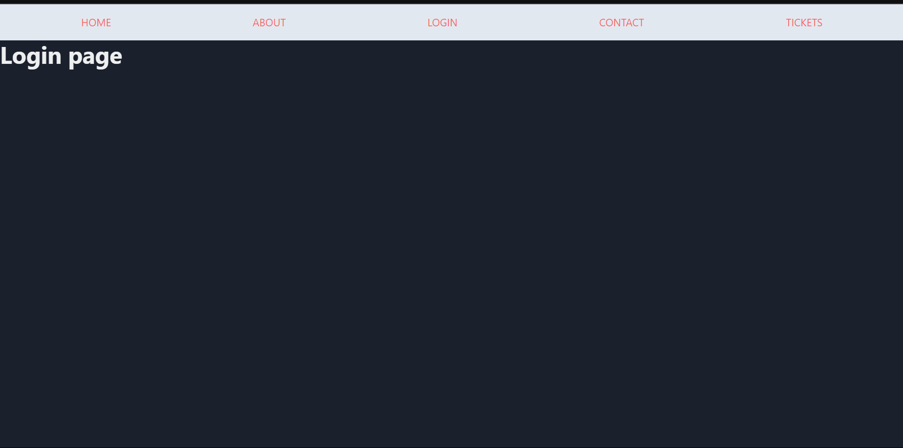
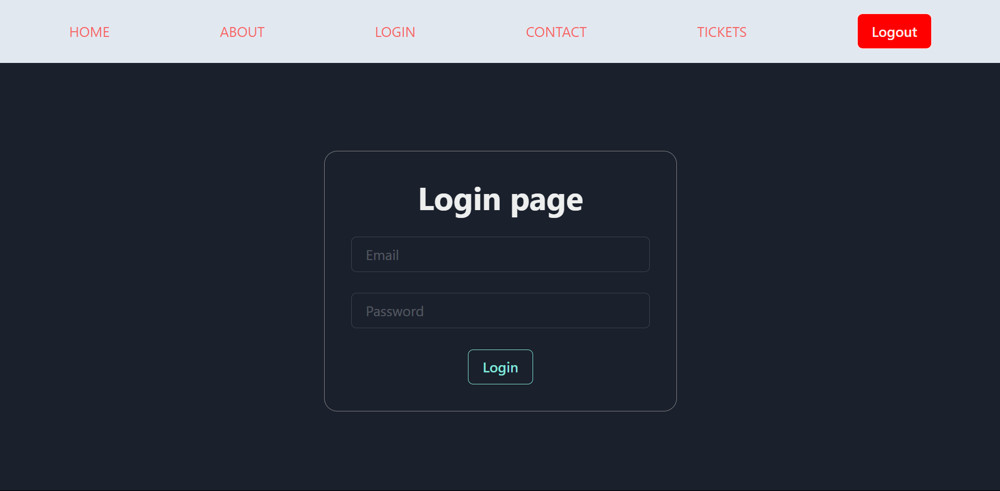

# Frontend - 1 

```
1. Setup Chakra UI React Router DOM and Axios.
2. Create basic pages 
  - Home 
  - About
  - Contact
  - Login
  - Task
```



># Frontend 2

  - work on home page - `useNavigate()` from `react-router-dom`
  - work on login page - Axios  - Make a post request and login user.
  - now working on Login page
  - Setup AuthContext, Save token in AuthContext, Implement Login and
Logout functionality in application
  - Setup Protected Routes or Private Routes Implement Private Routes

  


># Frontend 3


```
starting 11 min talking about after clicking the button how to redirect the page
Example After clicking login button Redirect the Home page
```

# Tickets Page

## Create Ticket Button (complete)
- Positioned at the top right corner.
- Redirects to the Ticket Create page.

## Ticket Cards (complete)
- Displayed in a grid layout.
  - **Large Screens and Above**: 3 cards per row.
  - **Medium Screens and Above**: 2 cards per row.
  - **Small Screens**: 1 card per row.
- Each card includes:
  - **Title**: [Ticket Title]
  - **Status**: [Ticket Status]
  - **Priority**: [Ticket Priority]
  - **View Button**: Redirects to the Ticket View page.

## Sorting and Filtering Options

### Sort by Priority
- Options: 
  - Low to High
  - High to Low

### Filter by Status
- Options: 
  - Pending
  - Progress
  - Completed

## Functional Behavior
- **Create Ticket Button**: Redirects to the Ticket Create page.
- **View Button**: Redirects to the Ticket View page.
- **Sort by Priority**: Rearranges tickets based on selected priority.
- **Filter by Status**: Displays tickets matching the selected status.


># Frontend 4

># Ticket Create Page

Include the following elements to create a new ticket:

- Input box for Title
- TextArea for Description
- Select box for Assignee details (values: names of assignees)
- Select box for Status (values: "Pending", "Progress", "Completed")
- Select box for Priority level (values: 0 to 9)
- Create Ticket button to submit the form, making a POST request to update the ticket information on both the server and client. Redirect to the Tickets page upon successful creation.


># Ticket View Page

## Overview
The Ticket View Page displays detailed information about a specific ticket. It includes the following details:
- Title
- Description
- Assignee
- Status
- Priority

Additionally, the page provides two action buttons:
- Edit: Redirects the user to the Ticket Edit page.
- Delete: Deletes the ticket and redirects the user back to the Tickets page.

## Components and Functionality

### Ticket Details
The page should display the following ticket details:
- **Title**: The title of the ticket.
- **Description**: A detailed description of the ticket.
- **Assignee**: The name of the person assigned to the ticket.
- **Status**: The current status of the ticket (Pending, Progress, Completed).
- **Priority**: The priority level of the ticket (0 to 9).

### Edit Button
- **Purpose**: Allows the user to edit the ticket.
- **Functionality**: When clicked, the Edit button redirects the user to the Ticket Edit page.
- **Implementation**: Use React Router's `useHistory` hook or a Link component to navigate to the Ticket Edit page.

### Delete Button
- **Purpose**: Allows the user to delete the ticket.
- **Functionality**: When clicked, the Delete button sends a DELETE request to the server to remove the ticket. Upon successful deletion, the user is redirected back to the Tickets page.
- **Implementation**: Use Axios to send a DELETE request to the appropriate API endpoint. Upon success, use React Router's `useHistory` hook to redirect the user to the Tickets page.
